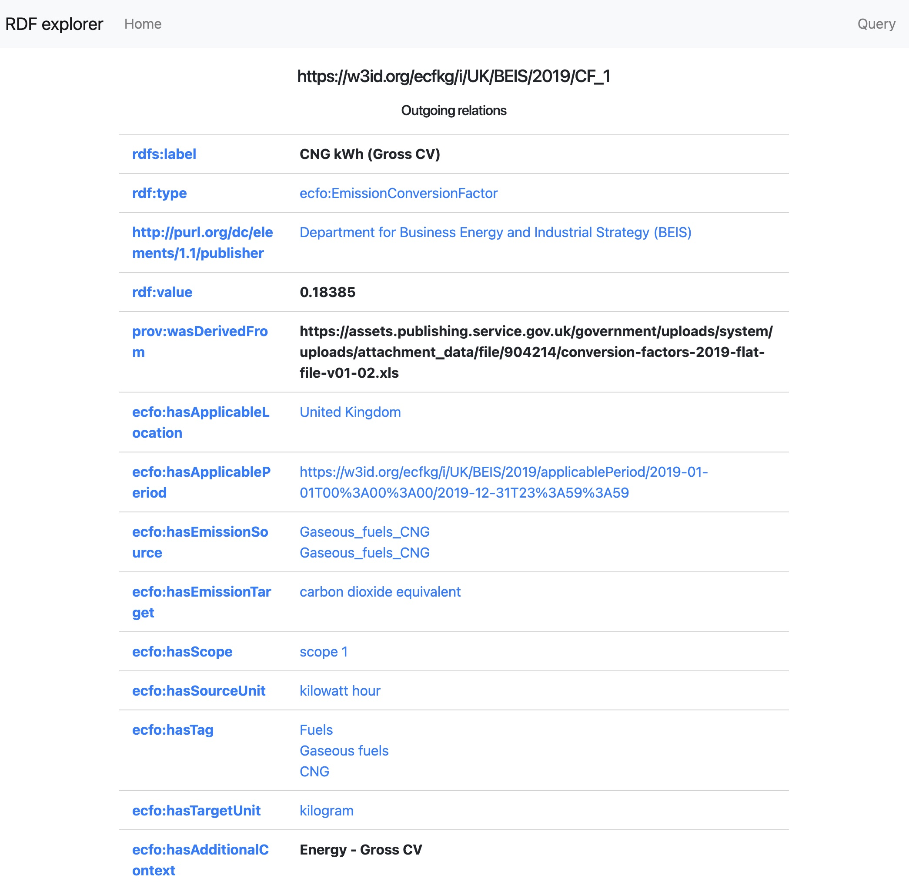
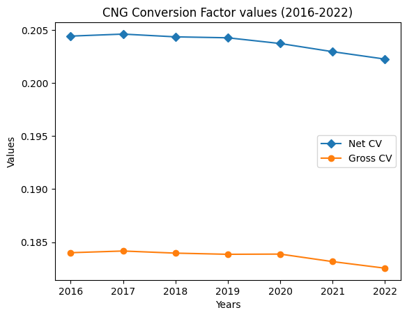

[Back to main page](./)

# Getting started

In this page we provide an overview of the entry points for using the TEC-Toolkit resources. [ECFO](/#the-emission-conversion-factor-ontology-ecfo) and [PECO](/#the-provenance-of-emission-calculations-ontology-peco) ontologies may be use together or separately. For example, the [Emissions Conversion Factors KG](/#emissions-conversion-factors) uses ECFO and can be used as a lookup database of conversion factors (see [how below](/#retrieve-a-conversion-factor)).

PECO may be used to describe the emission calculation process, which typically also involves the conversion factors and hence the combination of PECO and ECFO may be desired. Semantic Machine Learning Impact calculator is a prototype software that demonstrates how PECO and Emissions Conversion Factors KG can be embedded within a web-based application [see how can you download a PECO trace](/#download-a-peco-trace).

For further information on ECFO and PECO follow the w3id link that will let you download the ontologies and/or view the online documentation.

Please see the [SMLI Calculator](/#smli-calculator) for a link to online demo and source code to further explore how the individual components of the TEC toolkit might be integrated in a software application.

## Retrieve an Emission Conversion Factor (ECF) Metadata

The simplest way of browsing the metadata of an emission factor is just pasting its URI in a browser. For example, [https://w3id.org/ecfkg/i/UK/BEIS/2019/CF_1](https://w3id.org/ecfkg/i/UK/BEIS/2019/CF_1) will take you to an online page like this one:



where you can see the units, value and source (among others) of the emission conversion factor. However, how to get to the ECF URI? One way of doing it is using SPARQL queries. We have set up a simple [SPARQL query interface](https://query.cf.linkeddata.es/query) where you can create SPARQL queries and retrieve the IDs of the ECFs you may be interested in. For example, to retrieve ECFs related to "CNG" (compressed natural gas) to CO2e (in kg) and within Scope 1, just issue the following query:

```sparql
PREFIX rdf: <http://www.w3.org/1999/02/22-rdf-syntax-ns#>
PREFIX rdfs: <http://www.w3.org/2000/01/rdf-schema#>
PREFIX ecfo: <https://w3id.org/ecfo#>
prefix qudt: <http://qudt.org/schema/qudt/>

select ?context ?cf ?s ?t where{
    ?cf ecfo:hasTag ?tag;
        ecfo:hasEmissionSource ?s;
        ecfo:hasEmissionTarget ?t;
        ecfo:hasTargetUnit ?tu;
    ecfo:hasScope <https://w3id.org/ecfo#Scope1>.
    ?tag rdfs:label "CNG"@en.
    ?t rdfs:label "carbon dioxide equivalent"@en .
    ?tu qudt:abbreviation "kg"@en.
   optional {
     ?cf <https://w3id.org/ecfo#hasAdditionalContext> ?context
   }
}
```
The results will include several ECFs, make sure you read their details before selecting the one of interest. For example two of the results include:

```json
{'context': {'type': 'literal', 'xml:lang': 'en', 'value': 'Energy - Gross CV'}, 'cf': {'type': 'uri', 'value': 'https://w3id.org/ecfkg/i/UK/BEIS/2019/CF_1'}, 's': {'type': 'uri', 'value': 'https://w3id.org/ecfkg/i/Gaseous_fuels_CNG'}, 't': {'type': 'uri', 'value': 'http://www.wikidata.org/entity/Q1933140'}}
{'context': {'type': 'literal', 'xml:lang': 'en', 'value': 'Tonnes'}, 'cf': {'type': 'uri', 'value': 'https://w3id.org/ecfkg/i/UK/BEIS/2019/CF_13'}, 's': {'type': 'uri', 'value': 'https://w3id.org/ecfkg/i/Gaseous_fuels_CNG'}, 't': {'type': 'uri', 'value': 'http://www.wikidata.org/entity/Q1933140'}}

```
Note that these include conversion factors as indicated, but within two different contexts: one includes the gross calorific value, while the other includes the net calorific value. Adding a filter for retrieving only the gross calorific value, we get all the ECF values for Butane to CO2e (in kg) throughout the availbale years (2016-2022):

```sparql
PREFIX rdf: <http://www.w3.org/1999/02/22-rdf-syntax-ns#>
PREFIX rdfs: <http://www.w3.org/2000/01/rdf-schema#>
PREFIX ecfo: <https://w3id.org/ecfo#>
PREFIX qudt: <http://qudt.org/schema/qudt/>

select ?cf ?value ?start ?end ?context where{
    ?cf ecfo:hasTag ?tag;
        ecfo:hasEmissionSource ?s;
        ecfo:hasEmissionTarget ?t;
        ecfo:hasTargetUnit ?tu;
        ecfo:hasAdditionalContext ?context; 
        rdf:value ?value;
        ecfo:hasScope ecfo:Scope1;
        ecfo:hasApplicablePeriod ?period.
    filter(regex(?context,"Gross cv","i")) . 
    ?tag rdfs:label "CNG"@en.
    ?t rdfs:label "carbon dioxide equivalent"@en .
    ?tu qudt:abbreviation "kg"@en.
    ?period <http://www.w3.org/2006/time#hasBeginning>/<http://www.w3.org/2006/time#inXSDDate> ?start;
         <http://www.w3.org/2006/time#hasEnd>/<http://www.w3.org/2006/time#inXSDDate> ?end
}
```

## Plotting the evolution of an Emission Conversion Factor

Once we have retrieved the values of the ECF of interest, we can easily plot the results. The following image shows the variation for CNG to CO2e from 2016-2022. Please note that we have adjusted the axis to show the differences, since the variation of this particular ECF is minimal:



All these queries and plot are available in a [Jupyter notebook](https://github.com/TEC-Toolkit/cfkg/blob/main/tutorial/Using_CFKG_Evolution_of_Conversion_Factors_through_the_years.ipynb) in our [cfkg repository](https://github.com/EATS-UoA/cfkg).

## PECO trace

* To test an example provenance trace of emission calculations use this [TTL file](https://github.com/TEC-Toolkit/PECO/blob/main/cqs/provenance_trace.ttl).

* See [here](https://github.com/TEC-Toolkit/PECO/blob/main/cqs/README.md) for a list of example SPARQL queries that can be run on this data.

For example, this query will retrieve the emission score and the activity for which this score was calculated:

```sparql
PREFIX peco: <https://w3id.org/peco#>
PREFIX qudt: <http://qudt.org/schema/qudt/>
PREFIX rdf:  <http://www.w3.org/1999/02/22-rdf-syntax-ns#>
PREFIX rdfs: <http://www.w3.org/2000/01/rdf-schema#>

SELECT ?activityL ?score
WHERE {
    ?activity  rdf:type   peco:EmissionGenerationActivity ;
               rdfs:label ?activityL;
               peco:hasEmissionScore/qudt:value ?score.
}
```

* You can also run it online in our sample [Google Colab notebook](https://colab.research.google.com/drive/1wl9xA-0HQ5aWI-u517gC1ZwsC10eJZQa?usp=sharing).

## Ontologies

### The Emission Conversion Factor Ontology (ECFO)

{: width="5%"}

Available at: [https://w3id.org/ecfo](https://w3id.org/ecfo)

Evaluation & Examples: [CQs and SPARQL queries](https://github.com/TEC-Toolkit/PECO/tree/main/cqs)

Aims to provide a generic model for describing the values of Emission Conversion Factors and their associated metadata.


### The Provenance of Emission Calculations Ontology (PECO)

{: width="5%"}

Available at: [https://w3id.org/peco](https://w3id.org/peco)

Evaluation & Examples: [CQs and SPARQL queries](https://github.com/TEC-Toolkit/ECFO/tree/main/cqs)

Defines a vocabulary for describing provenance traces of carbon emissions calculations by capturing the quantifiable measurements of energy estimates (i.e., activity data and emission conversion factors used to estimate the carbon emissions).


## Emissions Conversion Factors KG

* [SPARQL endpoint interface](https://query.cf.linkeddata.es/). See [https://github.com/TEC-Toolkit/cfkg#sparql-endpoint](https://github.com/TEC-Toolkit/cfkg#sparql-endpoint) to learn more on doing queries. The SPARQL endpoint is at `https://sparql.cf.linkeddata.es/cf/`, but we highly recommend accessing the [query interface](https://query.cf.linkeddata.es/) to perform queries.
* [Knowledge Graph dump in Turtle](https://zenodo.org/record/7916096#.ZFugTo1BxEY)
* [GitHub repository](https://github.com/TEC-Toolkit/cfkg)

In the following, we outline the Emission Conversion Factors described using ECFO.

### BEIS (UK)

Official list of emission conversion factors for use by UK and international organisations to report on greenhouse gas.

* Publisher: [BEIS](https://www.gov.uk/government/collections/government-conversion-factors-for-company-reporting)
* Country: UK

| Year  | Number of CFs |
| :---: | :-----------: |
| 2022  |     6464      |
| 2021  |     6284      |
| 2020  |     6140      |
| 2019  |     6163      |
| 2018  |     6192      |
| 2017  |     6178      |
| 2016  |     4977      |

### MLI

A collection of Scope 2 electricity emission conversion factors from a range of sources.

* Publisher: [MLI](https://github.com/mlco2/impact) 
* Country: Various

|    Year    | Number of CFs |
| :--------: | :-----------: |
| 2002 -2019 |      81       |

<!--
| Year       | Publisher                                                                                             | Country | Description                                                                                                                       | Number of Conversion Factors |
| :--------- | :---------------------------------------------------------------------------------------------------- | :------ | :-------------------------------------------------------------------------------------------------------------------------------- | :--------------------------- |
| 2022       | [BEIS](https://www.gov.uk/government/collections/government-conversion-factors-for-company-reporting) | UK      | Official list of emission conversion factors for use by UK and international organisations to report on greenhouse gas emissions. | 6464                         |
| 2021       | [BEIS](https://www.gov.uk/government/collections/government-conversion-factors-for-company-reporting) | UK      | Official list of emission conversion factors for use by UK and international organisations to report on greenhouse gas emissions. | 6284                         |
| 2020       | [BEIS](https://www.gov.uk/government/collections/government-conversion-factors-for-company-reporting) | UK      | Official list of emission conversion factors for use by UK and international organisations to report on greenhouse gas emissions. | 6140                         |
| 2019       | [BEIS](https://www.gov.uk/government/collections/government-conversion-factors-for-company-reporting) | UK      | Official list of emission conversion factors for use by UK and international organisations to report on greenhouse gas emissions. | 6163                         |
| 2018       | [BEIS](https://www.gov.uk/government/collections/government-conversion-factors-for-company-reporting) | UK      | Official list of emission conversion factors for use by UK and international organisations to report on greenhouse gas emissions. | 6192                         |
| 2017       | [BEIS](https://www.gov.uk/government/collections/government-conversion-factors-for-company-reporting) | UK      | Official list of emission conversion factors for use by UK and international organisations to report on greenhouse gas emissions. | 6178                         |
| 2016       | [BEIS](https://www.gov.uk/government/collections/government-conversion-factors-for-company-reporting) | UK      | Official list of emission conversion factors for use by UK and international organisations to report on greenhouse gas emissions. | 4977                         |
| 2002 -2019 | [MLI](https://github.com/mlco2/impact)                                                                | Various | A collection of Scope 2 electricity emission conversion factors from a range of sources.                                          | 81                           |
-->

## Software

### SMLI Calculator

The [Semantic Machine Learning Impact Calculator](https://github.com/TEC-Toolkit/Semantic_Machine_Learning_Impact_Calculator) is an extension of the [Machine learning Impact (MLI) calculator](https://mlco2.github.io/impact\#compute) with semantic components to perform the emission calculations.

***SMLI Demo***

An online demo can be found at [this link](https://calculator.linkeddata.es).

(Please note that currently only Chromium-based browsers are supported)

***How it works***

SMLI Calculator queries the live ECFO KG to retrieve the information about the available conversion factors that match the user input.

An example call to [Java-based backend](https://github.com/TEC-Toolkit/Semantic_Machine_Learning_Impact_Calculator/blob/main/src/main/java/io/github/tectoolkit/calculator/Controller.java) that queries the ECFO KG for corresponding conversion factors:

````java
fetch("/cf_info_all?region=" + region)
    .then((response) =>
      response.json()
    )
    .then((CF_data) =>
      { [...] }
    )
````

A SPARQL query executed to retrieve conversion factors for a specific region of compute:

```sparql
PREFIX  ecfo: <https://w3id.org/ecfo#>
PREFIX  geo:   <http://www.opengis.net/ont/geosparql#>
PREFIX  prov: <http://www.w3.org/ns/prov#>
PREFIX  qudt: <http://qudt.org/schema/qudt/>
PREFIX  rdf:   <http://www.w3.org/1999/02/22-rdf-syntax-ns#>
PREFIX  rdfs: <http://www.w3.org/2000/01/rdf-schema#>
PREFIX  time: <http://www.w3.org/2006/time#>

SELECT DISTINCT ?id ?sourceUnit ?targetUnit ?source ?value ?applicableLocation ?applicablePeriodStart ?applicablePeriodEnd ?emissionTargetSymbol
WHERE {
  ?id       rdf:type            ecfo:EmissionConversionFactor ;
              ecfo:hasTargetUnit  ?targetUnitInst .
    ?targetUnitInst
              rdfs:label          "kilogram"@en .
    ?id ecfo:hasEmissionTarget/rdfs:label ?emissionTargetSymbol
      { ?id ecfo:hasApplicableLocation/rdfs:label "europe-west2"@en }
    UNION
      { ?id (ecfo:hasApplicableLocation/geo:ehContains)/rdfs:label "europe-west2"@en .
        ?id  ecfo:hasScope         ecfo:Scope2 ;
             ecfo:hasTag           <https://w3id.org/ecfkg/i/UK%20electricity> ;
             ecfo:hasEmissionTarget  <http://www.wikidata.org/entity/Q1933140>
      }
    OPTIONAL
      { ?id  ecfo:hasSourceUnit  ?sourceUnitInst }
    OPTIONAL
      { ?id  ecfo:hasApplicableLocation  ?location }
    OPTIONAL
      { ?id (ecfo:hasApplicablePeriod/time:hasBeginning)/time:inXSDDate ?applicablePeriodStart }
    OPTIONAL
      { ?id (ecfo:hasApplicablePeriod/time:hasEnd)/time:inXSDDate ?applicablePeriodEnd }
    OPTIONAL
      { ?id  prov:wasDerivedFrom  ?source }
    OPTIONAL
      { ?id  rdf:value  ?value }
    OPTIONAL
      { ?location  rdfs:label  ?applicableLocation }
    OPTIONAL
      { ?targetUnitInst qudt:abbreviation  ?targetUnit }
    OPTIONAL
      { ?sourceUnitInst qudt:abbreviation  ?sourceUnit }
  }
ORDER BY DESC(?applicablePeriodEnd)
```

The calculator also produces JSON-LD descriptions of provenance traces documenting the individual steps of emissions calculation process. [JSON-LD context](https://github.com/TEC-Toolkit/Semantic_Machine_Learning_Impact_Calculator/blob/main/src/main/resources/static/js/tec-context.js) and set of custom [JavaScript Functions](https://github.com/TEC-Toolkit/Semantic_Machine_Learning_Impact_Calculator/blob/main/src/main/resources/static/js/tec-lib.js) are used to query ECFO KG to retrieve the information about the Emission Conversion Factors and to generate portion of the provenance trace.

Together with the calculated emission score, the GUI also shows detailed information about the activities performed during the calculation process, the conversion factor used and other relevant conversion factors that are applicable to the user input:


An example of generating description of activity with a connected input entity in the [code that calculates the emissions](https://github.com/TEC-Toolkit/Semantic_Machine_Learning_Impact_Calculator/blob/main/src/main/resources/static/js/grayscale.js):

```javascript
let wattConsumption = createCalculationEntity("Watt Consumption", state.gpus[gpu].watt, "http://www.wikidata.org/entity/Q25236", "http://www.wikidata.org/entity/Q1053879", graphLD, "")

let electricityUseEstimate = createCalculationActivity("https://github.com/TEC-Toolkit/Semantic_Machine_Learning_Impact_Calculator", "Estimate Electricity Use in kW/h", graphLD)

linkInputEntityToActivity(wattConsumption, electricityUseEstimate, graphLD)
```

The calculator also executes a number of validation queries, for example, to check if the latest available conversion factor is up-to-date:

```sparql
PREFIX  ecfo: <https://w3id.org/ecfo#>
PREFIX  peco: <https://w3id.org/peco#>
PREFIX  prov: <http://www.w3.org/ns/prov#>
PREFIX  rdf:  <http://www.w3.org/1999/02/22-rdf-syntax-ns#>
PREFIX  time: <http://www.w3.org/2006/time#>

SELECT DISTINCT  ?cf ?cf_value ?time
WHERE {
  ?entity  rdf:type  peco:EmissionScore .
  ?entity prov:wasGeneratedBy/prov:used ?cf .
  ?cf (ecfo:hasApplicablePeriod/time:hasEnd)/time:inXSDDate ?time .
  ?cf  rdf:value  ?cf_value
  FILTER ( ?time < now() )
}
```

The results are presented in the GUI:


The provenance trace can be also downloaded by the user:


For expanded example of provenance trace and additional queries please see [our competency questions](https://github.com/TEC-Toolkit/PECO/tree/main/cqs).

### Data Validation

The [Data Validation component](https://github.com/TEC-Toolkit/Data-Validation) runs Datalog rules to detect violations of conditions according to ECFO.

### Functionalities

#### Check if the data are "valid"

1. [Run the data validation module](https://github.com/TEC-Toolkit/Data-Validation#running-rdfox)
2. Check that all queries have **0** answers

#### Add another validation check

1. Add a file "check-CUSTOM_NAME-rules" with the rules to check
2. Add a file "check-CUSTOM_NAME-queries" with the `ASK` queries
   * Note that the queries must return no answer if the check is passed
3. Add a new command `exec check CUSTOM_NAME` in the "validate" file

[Back to main page](./)
